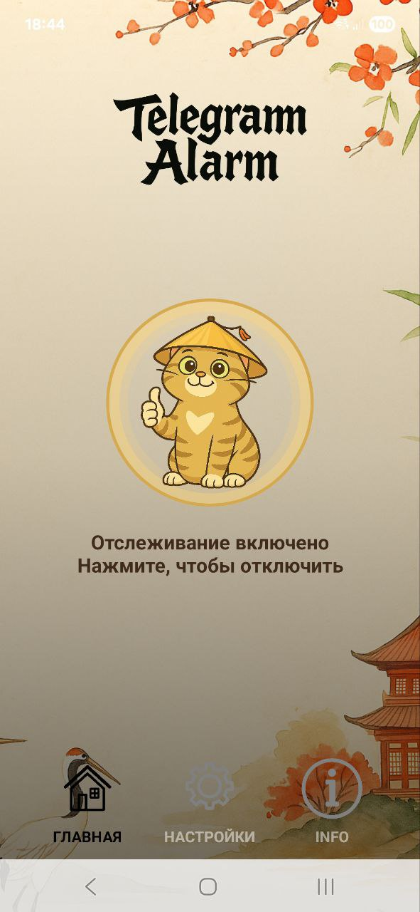
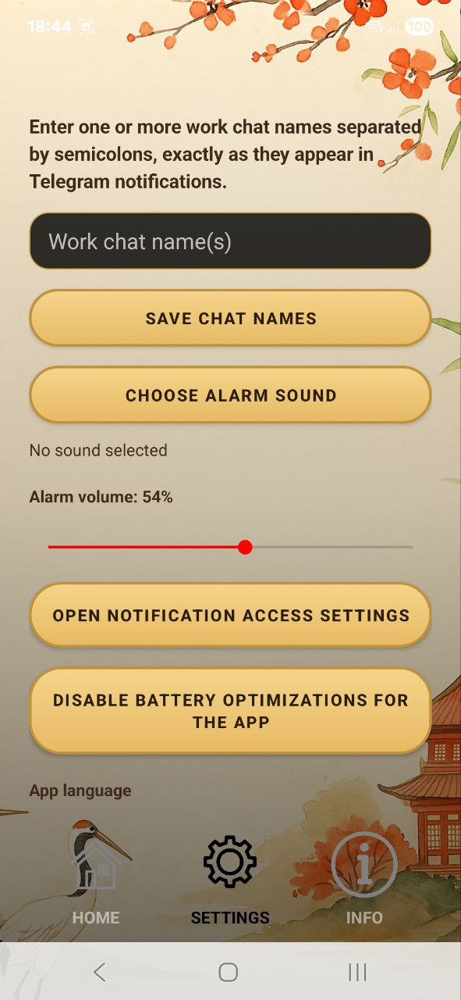
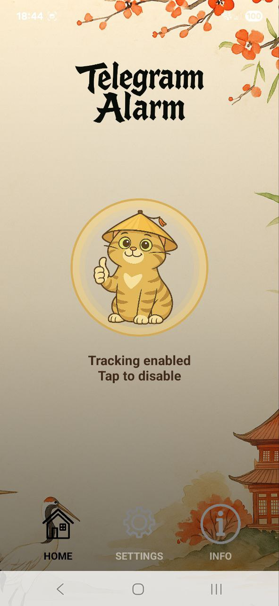
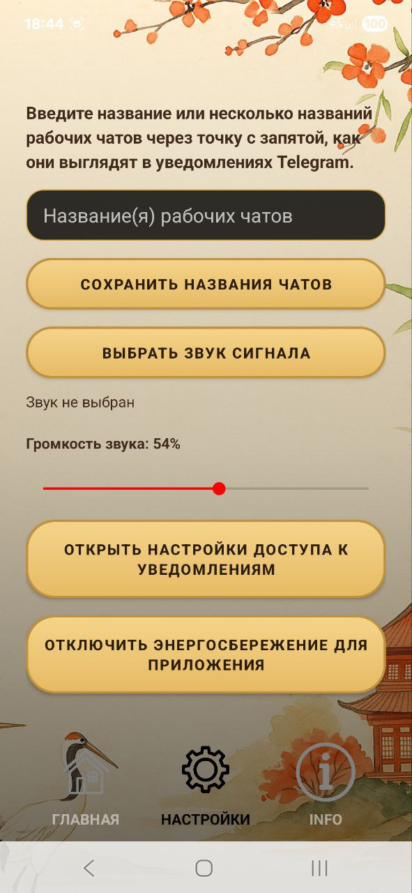

\# TelegramAlarm

!\[Android CI](https://github.com/kevin-popins/TelegramAlarm/actions/workflows/android.yml/badge.svg)


RU. TelegramAlarm — лёгкое Android-приложение, которое превращает входящие уведомления (прежде всего Telegram) в «будильник» для выбранных рабочих чатов. Это не клиент Telegram и не интеграция с Telegram API. Утилита работает на уровне системных уведомлений Android через Notification Listener Service и запускает сигнал через foreground service, чтобы повысить надёжность в фоне.


EN. TelegramAlarm is a lightweight Android utility that turns incoming notifications (primarily Telegram) into an “alarm” for selected work chats. It is not a Telegram client and does not use the Telegram API. The app works by processing Android system notifications via Notification Listener Service and triggers playback via a foreground service for more reliable background operation.


\## Run


Android Studio: open the project, wait for Gradle Sync, then run the `app` configuration.


Terminal build:

```bash

./gradlew assembleDebug


```


Screenshots

<p align="center">     </p>

Notes


RU. Для работы обязательно включить доступ к уведомлениям (Notification Listener) и отключить энергосбережение для приложения, иначе Android может задерживать события и выгружать компонент в фоне.


EN. You must enable Notification Listener access and disable battery optimizations for the app; otherwise Android may delay notification events and kill background components.

